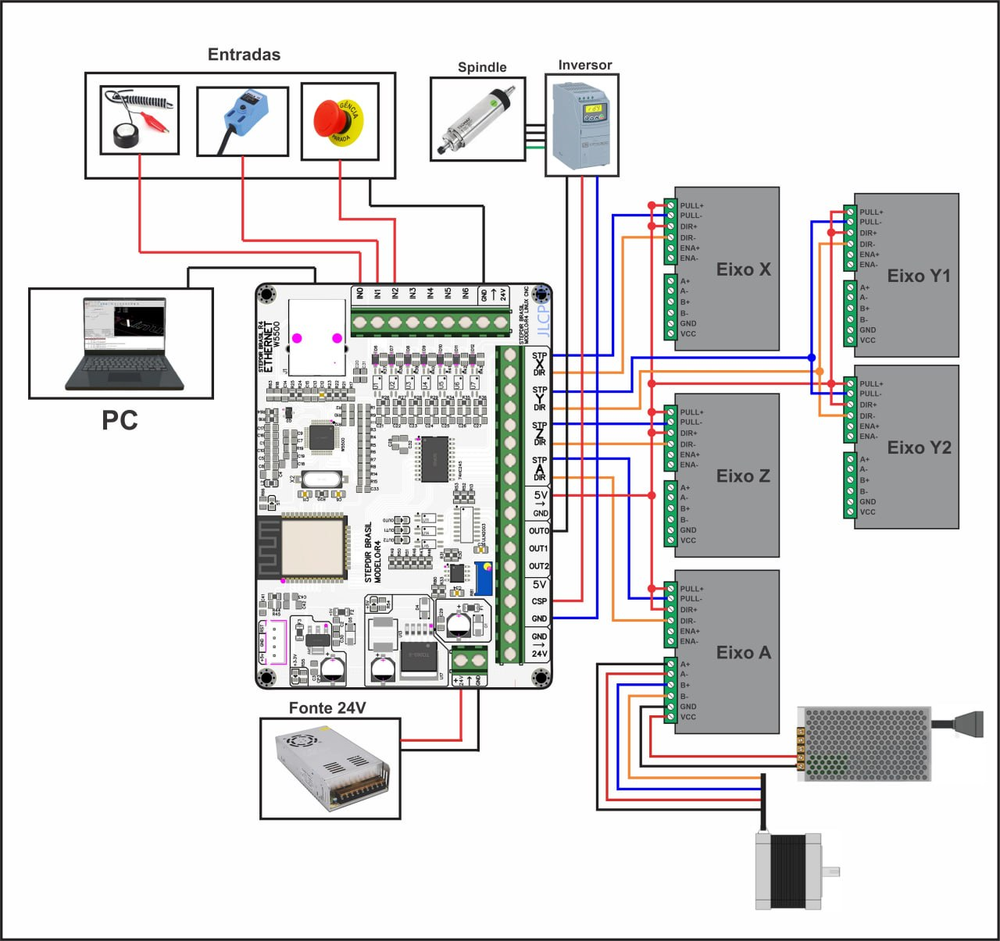

# StepDirR4

Automatização da instalação e configuração da placa **StepDir R4** — primeira placa controladora LinuxCNC do Brasil.

O software substitui o passo a passo manual por dois fluxos guiados (interface GTK3, PT-BR):

1. **Instalador** (roda uma vez): configura a rede ethernet dedicada da placa, instala os drivers realtime com backup dos originais e monta a configuração da máquina em `~/linuxcnc/configs/R4` com atalho na área de trabalho.
2. **Configurador** (uso contínuo): edita `R4.ini`/`R4.hal` por abas (eixos, spindle, probes, entradas/saídas estilo "ports and pins" do Mach3), com Aplicar/Salvar e reinício do LinuxCNC.

**Estado atual (1.x)**: núcleo editor de configuração (parser round-trip de `R4.ini`/`R4.hal`, whitelist de 85 campos em 8 abas, regras de derivação — DEADBAND, espelhos AXIS/JOINT e TRAJ, sinal do home do Z, toggle do eixo A) **+ wizard gráfico de instalação completo** (pré-checagens → rede dedicada → drivers → modelo → dimensões → verificação) **+ configurador gráfico por abas** (estilo "ports and pins": eixos X/Y/Z/A, spindle, probes, entradas/saídas; Aplicar com backup / Salvar / Cancelar; Reiniciar LinuxCNC). **F5**: pacote `.deb` (`./empacotar.sh`), testado nas duas versões do ISO do LinuxCNC.

## Requisitos

- ISO oficial do LinuxCNC (Debian 12 ou 13, kernel PREEMPT-RT) com `linuxcnc-uspace`.
- Placa StepDir R4 conectada por cabo de rede (RJ45) dedicado.
- Python 3.11+ e GTK3/PyGObject (já inclusos no ISO oficial).

## Esquema de ligação (Spark V2)



A configuração que o instalador copia para `~/linuxcnc/configs/R4` já vem com os pinos deste esquema:

| Recurso | Pino | Observação |
|---|---|---|
| Probe | `IN0` | sinal invertido — a garra vai no IN0 e a base no GND, então o toque puxa para o GND |
| Home e fins de curso | `IN1` | o mesmo pino serve aos dois, em polaridades opostas |
| Botão de emergência | `IN2` | normal fechado (sinal invertido) |
| Spindle horário (CW) | `OUT0` | vai ao inversor |
| Esquadro / refrigeração | `OUT2` | |

`IN3`–`IN6` e `OUT1` ficam livres. Se a sua montagem for diferente, troque os pinos na aba **Entradas/Saídas** do configurador em vez de mexer no arquivo à mão.

**Sensores de home/fim de curso**: o padrão de fábrica espera um sensor que *liga* ao detectar. O indutivo NPN normal aberto — o mais comum — faz o contrário: fica ligado em repouso e desliga ao detectar. Com ele, o fim de curso funciona mas o home nasce acionado com a máquina parada, e o referenciamento sai errado. Para esse caso marque **"Home e fins de curso — sensor desliga ao detectar"** (aba Entradas/Saídas, expander *Avançado*).

Para conferir qual é o seu caso, com o LinuxCNC aberto e o sensor livre:

```bash
halcmd show pin R4.input.1
```

`TRUE` = sensor ligado em repouso, marque a opção. `FALSE` = padrão de fábrica, deixe desmarcada.

## Instalação

### Pacote `.deb` (recomendado)

Um único pacote instala o aplicativo (`/usr/bin/stepdir-r4`), o helper de drivers e os 3 `.so` (`/usr/libexec/stepdir-r4/`), a política polkit, os atalhos do menu e os templates da Spark V2.

Na máquina do LinuxCNC:

1. Baixe o `.deb` mais recente na página de **[Releases](https://github.com/LiYuanBr/StepDirR4/releases)** (arquivo `stepdir-r4_<versão>_amd64.deb`, em *Assets*).
2. Abra um terminal e instale (o arquivo baixado fica em `~/Downloads`):

```bash
cd ~/Downloads
sudo apt install ./stepdir-r4_0.1.2_amd64.deb
```

3. Abra **StepDir R4 — Setup** no menu de aplicativos (categoria **CNC**) e siga o assistente.

O configurador de uso contínuo fica em **StepDir R4 — Config** (`stepdir-r4 configurar`). Todos os subcomandos da CLI abaixo funcionam trocando `PYTHONPATH=src python3 -m stepdir_r4` por `stepdir-r4`.

O `.deb` **não** grava os drivers em `/usr/lib/linuxcnc/modules` na instalação do pacote (conflitaria com o `linuxcnc-uspace`): eles ficam em `/usr/libexec/stepdir-r4/drivers/` e são copiados pelo wizard/`stepdir-r4 drivers`, com senha e backup datado. Instalado pelo pacote, o helper root só aceita essa pasta como origem (e a autorização polkit não fica em cache).

**Gerar o pacote** (em qualquer Debian/Ubuntu, a partir do código-fonte):

```bash
sudo apt install build-essential debhelper dh-python pybuild-plugin-pyproject python3-all python3-setuptools lintian
./empacotar.sh            # → dist/stepdir-r4_<versão>_amd64.deb (+ relatório do lintian)
```

O pacote é `Architecture: amd64` — serve qualquer PC **Intel ou AMD de 64 bits** (amd64 é o nome da arquitetura x86-64, não a marca do processador). Não há suporte a ARM (ex.: Raspberry Pi): os drivers `.so` do fabricante são binários x86-64. Versão em `pyproject.toml` e `debian/changelog` (devem bater).

> `debian/changelog` **não é versionado** — é local de quem empacota. Sem ele o `dpkg-buildpackage` não roda, então um clone limpo precisa criar o arquivo antes de gerar o `.deb`. Os pacotes oficiais saem da página de [Releases](https://github.com/LiYuanBr/StepDirR4/releases).


### Instalando o LinuxCNC (pré-requisito)

O software (e o wizard, na verificação do sistema) mostra este mesmo passo a passo quando o LinuxCNC ou o kernel realtime estão faltando:

**Opção 1 — ISO oficial (recomendada):**

1. Baixe o ISO em <https://linuxcnc.org/downloads/> (Debian 13 com kernel PREEMPT-RT e LinuxCNC 2.9 já prontos).
2. Grave o ISO em um pendrive (ex.: balenaEtcher) e instale no computador que vai comandar a máquina.
3. Rode este instalador de novo.

**Opção 2 — Debian 12 ou 13 já instalado:**

```bash
wget https://www.linuxcnc.org/linuxcnc-install.sh
chmod +x linuxcnc-install.sh
sudo ./linuxcnc-install.sh          # configura o repositório oficial
sudo apt install linuxcnc-uspace    # se o script não instalar tudo
```

Depois reinicie e escolha o kernel PREEMPT-RT no menu de boot.

> Ubuntu e Pop!_OS **não têm** o pacote `linuxcnc-uspace` nem kernel realtime disponível — nessas distros, use a Opção 1.

### Rodando do código-fonte (sem instalar o pacote)

A instalação completa funciona pelo assistente gráfico: verificação do sistema, rede dedicada da placa, drivers e a pasta de configuração `~/linuxcnc/configs/R4` a partir dos templates embutidos da Spark V2.

```bash
git clone <este repositório>
cd StepDirR4

# assistente gráfico (recomendado)
PYTHONPATH=src python3 -m stepdir_r4
```

O wizard guia em 8 passos: boas-vindas → **verificação do sistema** (LinuxCNC, kernel PREEMPT-RT, GTK) → **rede da placa** (escolha a porta ethernet do cabo e siga; a conexão `StepDirR4` é criada ao avançar, com IP do PC `192.168.1.10/24` sem gateway — a internet do PC não é afetada; IP editável em "Avançado". A lista mostra a porta da internet marcada como tal e nunca a pré-seleciona) → **drivers** (instala `encoder.so`, `pwmgen.so` e `STEPDIR-R4.so` em `/usr/lib/linuxcnc/modules` com backup datado; pede a senha de administrador) → modelo da CNC (Spark V2) → dimensões da mesa (padrão 800×600 mm, atalho opcional no Desktop) → resumo → instalação + **verificação final** (ping na placa em `192.168.1.177` e integridade dos drivers). As etapas de rede e drivers podem ser puladas e feitas depois. Não execute como root — o assistente recusa.

Alternativa sem GUI (mesmos passos, pelo terminal):

```bash
# pré-checagens do sistema + estado dos drivers:
PYTHONPATH=src python3 -m stepdir_r4 checar

# rede dedicada da placa (porta detectada automaticamente se só uma não for a da internet):
PYTHONPATH=src python3 -m stepdir_r4 rede            # ou --dispositivo enp3s0 --ip 192.168.1.10

# drivers (pede a senha via pkexec, faz backup datado dos originais):
PYTHONPATH=src python3 -m stepdir_r4 drivers

# pasta de configuração (mesa padrão 800x600 mm):
PYTHONPATH=src python3 -m stepdir_r4 instalar        # ou --mesa-x 1000 --mesa-y 700

# verificação final (ping na placa + hash dos drivers; --com-halrun testa o loadrt):
PYTHONPATH=src python3 -m stepdir_r4 verificar
```

O passo `instalar` copia a configuração completa (nunca gera arquivos do zero), aplica `MAX_LIMIT = mesa + 15` nos eixos X/Y, resolve a pasta de programas (`PROGRAM_PREFIX`) via `xdg-user-dir` e cria `launch R4.desktop` + atalho da pasta no Desktop. Se já existir uma pasta `R4`, ela vira backup datado (`R4.bak-<data>`), nunca é perdida.

> Nota sobre a rede: `192.168.1.177` é o IP fixo da placa (não é gateway). Se o seu roteador também usa a faixa `192.168.1.x`, o instalador avisa o conflito — recomendado mudar a faixa do roteador. Um `apt upgrade` do LinuxCNC pode restaurar os drivers originais em silêncio; rode `verificar` (ou a página de drivers do wizard) para conferir e reinstalar.

### Configurador gráfico (uso contínuo)

Depois de instalada, a configuração é editada pelo configurador — sem abrir arquivo na mão:

```bash
PYTHONPATH=src python3 -m stepdir_r4 configurar          # ou --pasta /outra/pasta
```

Oito abas geradas da whitelist (Geral, Eixos X/Y/Z/A, Spindle, Probes, Entradas/Saídas estilo "ports and pins" do Mach3): campos básicos em evidência, avançados no expander "Avançado". O eixo A tem um toggle de habilitar/desabilitar (ajusta `[KINS]`/`[TRAJ]` e as ligações do joint 3 no HAL). Regras derivadas (ex.: `DEADBAND` a partir do `SCALE`) são recalculadas na hora e refletidas na tela.

Botões: **Aplicar** grava a aba atual com backup prévio (**Cancelar** restaura); **Salvar** grava direto; **Reiniciar LinuxCNC** fecha a instância aberta (com aviso) e reabre com a nova configuração. Comentários dos arquivos e edições manuais são preservados — o configurador só toca as variáveis da whitelist.

### Editar a configuração por código (mesma base do configurador)

```python
from stepdir_r4.core import ConfigR4

cfg = ConfigR4.abrir()                                # ~/linuxcnc/configs/R4
delta = cfg.definir("eixo_x.sentido_invertido", False)  # derivações voltam no delta
cfg.definir("io.emergencia.pino", 1)
cfg.aplicar()      # grava com backup (cfg.cancelar() restaura)
# cfg.salvar()     # grava direto, sem backup
```

Só variáveis da whitelist são alteradas; comentários dos arquivos e edições manuais são preservados byte a byte (edição *in-place*).

## Estrutura do projeto

```
src/stepdir_r4/
├── core/            # núcleo F1: editor in-place + instalador da pasta R4
│   ├── config.py    #   ConfigR4 (ler/definir/aplicar/salvar/cancelar)
│   ├── campos.py    #   whitelist (85 campos, 8 abas) e recursos de I/O
│   ├── documento.py #   modelo de linhas com round-trip byte-idêntico
│   └── instalador.py#   instalar_config()
├── gui/             # F2/F4: interfaces GTK3
│   ├── instalacao.py#   lógica pura do wizard (modelos, resumo, textos, markup)
│   ├── wizard.py    #   Gtk.Assistant (8 passos, inclui páginas de sistema)
│   ├── configurador_logica.py  # lógica pura do configurador (abas, faixas, textos)
│   └── configurador.py         # janela de abas (Notebook) gerada da whitelist
├── sistema/         # F3: integração de sistema
│   ├── checagens.py #   pré-checagens (LinuxCNC, kernel RT, GTK, versão)
│   ├── rede.py      #   conexão StepDirR4 via nmcli (sem gateway, overlap, arping)
│   ├── drivers.py   #   estado por hash, instalação via pkexec, teste halrun
│   ├── linuxcnc.py  #   detectar/parar/reabrir o LinuxCNC (botão Reiniciar)
│   ├── helper_drivers.py  # helper root mínimo (chamado por pkexec; no .deb em /usr/libexec/stepdir-r4)
│   └── *.policy     #   política polkit (instalada pelo .deb em /usr/share/polkit-1/actions)
├── __main__.py      # CLI: python3 -m stepdir_r4 / stepdir-r4 [wizard|configurar|instalar|checar|rede|drivers|verificar]
└── data/
    ├── config_r4/   # configuração pronta da Spark V2 → copiada para ~/linuxcnc/configs/R4
    └── drivers/     # drivers realtime (no .deb: /usr/libexec/stepdir-r4/drivers) → /usr/lib/linuxcnc/modules (com backup)
debian/              # F5: empacotamento (control, rules, .desktop ×2, ícone SVG)
empacotar.sh         # gera dist/stepdir-r4_<versão>_amd64.deb
imagens/             # esquema de ligação usado no README
```

## Licença

Ver [LICENSE](LICENSE).
